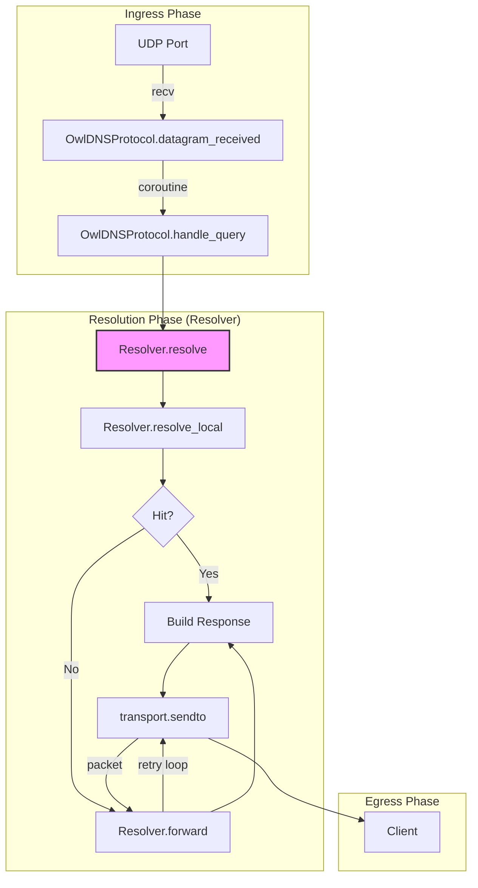

# 🦉 OwlDNS

[](#)
[](#)
[](#)
[](#)

**OwlDNS** 是一个极简、轻量的 Python 异步 DNS 服务端程序。

## ✨ 特性

- **Antigravity 风格**: 代码精简到极致，无冗余，高解耦。
- **异步驱动**: 基于 Python `asyncio` 构建，轻松处理高并发网络请求。
- **自定义解析**: 支持通过简单的字典配置静态 A 记录解析。
- **上游转发**: 支持可选的上游 DNS 转发（如 `8.8.8.8`），处理本地未命中的查询。
- **零配置安装**: 支持 Poetry 和 Pip 安装，提供开箱即用的命令行工具。
- **高测试覆盖**: 核心逻辑 100% 测试覆盖，整体覆盖率达 92% 以上。

## 🛠️ DNS 请求解析生命周期 (Lifecycle)

OwlDNS 的解析流程类似于 Web 框架的生命周期，通过一系列核心函数的协作完成从请求接收到响应回发的全过程：

### 生命周期阶段映射表

| 阶段 | 核心类/方法 | 作用说明 |
| :--- | :--- | :--- |
| **Bootstrap** | `OwlDNSServer.start` | 初始化 `Resolver`，创建异步 UDP 端点并绑定端口。 |
| **Ingress** | `Protocol.datagram_received` | 监听层入口，接收原始字节流。通过 `create_task` 派生异步处理任务。 |
| **Logic Task** | `Protocol.handle_query` | 异步任务主体，负责调用 Resolver 并确保结果通过 `transport` 回传。 |
| **Resolution** | `Resolver.resolve` | **核心流程控制器**。负责报文解析、本地匹配决策及上游转发路由。 |
| **Local Resolution** | `Resolver.resolve_local` | 封装了匹配与响应报文构建逻辑（A/AAAA 记录）。 |
| **Forwarding** | `Resolver.forward` | 当本地未命中时触发。处理上游 UDP 会话、超时控制及容灾。 |
| **Egress** | `transport.sendto` | 生命周期终点。将封装好的响应报文回派至客户端。 |

### 流程可视化



## 🚀 快速开始

### 1. 安装

使用 Poetry 进行安装：

```bash
git clone <your-repo-url>
cd OwlDNS
poetry install
```

或者使用 pip：

```bash
pip install .
```

### 2. 使用命令行 (CLI)

### 运行服务器

默认运行：
```bash
owldns run
```
这将监听 `127.0.0.1:5353`，并自动读取系统 `/etc/hosts` 文件。

自定义配置：
```bash
owldns run --port 54 --upstream 1.1.1.1 --hosts-file ./my_hosts
```

| 参数 | 描述 | 默认值 |
| :--- | :--- | :--- |
| `--host` | 监听地址 | `127.0.0.1` |
| `--port` | 监听端口 | `5353` |
| `--config` | 配置文件路径 | `None` |

### 3. 作为库调用

```python
import asyncio
from owldns import OwlDNSServer

async def main():
    # 初始化服务器
    server = OwlDNSServer(
        host="127.0.0.1",
        port=5353,
        # 支持多 IP 列表 (IPv4/IPv6 并存)
        records={"hello.world": ["10.0.0.1", "::1"]},
        # 使用结构化的上游配置
        upstreams=[
            {"address": "1.1.1.1", "group": "global", "proxy": None}
        ]
    )
    # 启动异步循环
    await server.start()

if __name__ == "__main__":
    asyncio.run(main())
```

## 🗺️ 路线图 (Roadmap)

我们计划在未来版本中引入以下特性：

- [x] **IPv6 (AAAA) 记录支持**: 实现对 IPv6 地址解析的完整支持。
- [x] **多上游转发支持**: 支持配置多个上游并按序尝试。
- [ ] **GeoDNS 与策略化路由 (Split-Horizon)**: 根据客户端 IP 的地理位置或域名解析请求进行智能分流。

## 🧪 测试

OwlDNS 极度重视稳定性，您可以运行以下命令查看覆盖率报告：

```bash
poetry run pytest --cov=owldns --cov-report=term-missing tests/
```

## 📄 开源协议

本项目采用 [MIT](LICENSE) 协议。
